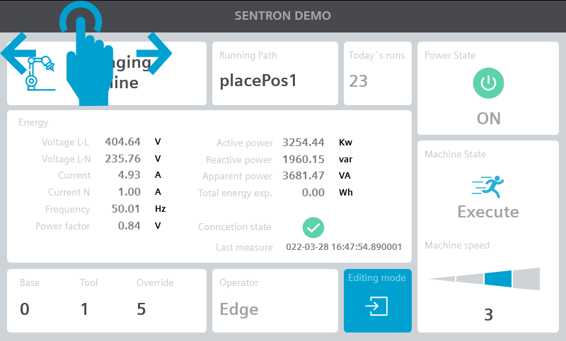
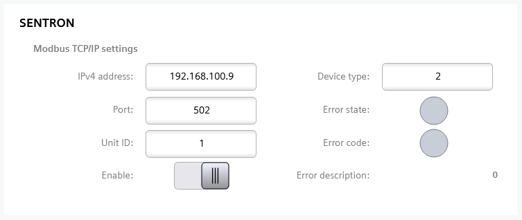

# edge-sentron

Edge application for SIMATIC WinCC Unified to read energy consumption from Siemens SENTRON series over Modbus TCP/IP.



## Energy data

List of **PAC2200** meter data:

| Measure                            | Units                 | Type          | 
| ---------------------------------- | --------------------- | ------------- | 
|  Voltage L1-N                      | V                     | Float         | 
|  Voltage L2-N                      | V                     | Float         |
|  Voltage L3-N                      | V                     | Float         |
|  Voltage L1-L2                     | V                     | Float         |
|  Voltage L2-L3                     | V                     | Float         |
|  Voltage L3-L1                     | V                     | Float         |
|  Current L1                        | A                     | Float         |
|  Current L2                        | A                     | Float         |
|  Current L3                        | A                     | Float         |
|  Apparent power L1                 | VA                    | Float         |
|  Apparent power L2                 | VA                    | Float         |
|  Apparent power L3                 | VA                    | Float         |
|  Active power L1                   | W                     | Float         |
|  Active power L2                   | W                     | Float         |
|  Active power L3                   | W                     | Float         |
|  Reactive power L1                 | var                   | Float         |
|  Reactive power L2                 | var                   | Float         |
|  Reactive power L3                 | var                   | Float         |
|  Power factor L1                   | -                     | Float         |
|  Power factor L2                   | -                     | Float         |
|  Power factor L3                   | -                     | Float         |
|  Frequency                         | Hz                    | Float         |
|  Average voltage L-N               | V                     | Float         |
|  Average voltage L-L               | V                     | Float         |
|  Average current                   | A                     | Float         |
|  Total apparent power              | VA                    | Float         |
|  Total active power                | W                     | Float         |
|  Total reactive power              | var                   | Float         |
|  Total power factor                | -                     | Float         |
|  Neutral current                   | A                     | Float         |
|  Active energy import              | Wh                    | Float         |
|  Reactive energy import            | varh                  | Float         |
|  Active energy export              | Wh                    | Float         |
|  Reactive energy export            | varh                  | Float         |

## Install the App

*edge-sentron* comes with pre-builded ```edge-sentron_x.x.x.app``` package that can be installed specifically on Unified Comfort Panels that runs SIMATIC Edge Runtime.

### Download the App

The **edge-sentron** app can be downloaded in .app format from this repository [edge-sentron_x.x.x.app](https://drive.google.com/drive/folders/1coGurU8VEtxEa04gEA1YxiTsP1GL1LKD)

### Prerequisites

1. A Unified Comfort Panel with SIMATIC Edge feature enabled.
2. At least one user needs to be signed up

### Load App on Unified Comfort Panels

1. Copy the downloaded ```edge-sentron_x.x.x.app``` file to your Developer PC.
2. Open the Industrial Edge Management Web Page of UCP on ```https://<ucp-address>```
3. Import the .app file using the *Import Offline* button
4. Wait until App is installed

## WinCC Unified Configuration

In order for the application to work, it is necessary to insert some elements inside your WinCC Unified project, including :

- **"EdgeSentronTags"** Table Variables;

These elements are included in a TIA Portal V17 library **"EdgeSentronLibrary"** provided along with the edge-sentron application and an application example.

### "EdgeSentronLibrary" Library Import

From the TIA Portal V17 engineering software, open the **"Library"** side menu.
Use the **"Open Global Libraries"** button and import the ```EdgeSentronLibrary.zal17``` file.

### Table "EdgeSentronTags" variables

Import the **"EdgeSentronTags"** Tags table within the HMI Tags of your TIA Portal V17 project.

Below are the details of the HMI Tags of the **"EdgeSentronTags"** variables table.

| HMI Tag Name                       | Type                  | Description                        | 
| ---------------------------------- | --------------------- | ---------------------------------- | 
|  L1_N                              | Real                  | Voltage L1-N [V]                   |
|  L2_N                              | Real                  | Voltage L2-N [V]                   |
|  L3_N                              | Real                  | Voltage L3-N [V]                   |
|  L1_L2                             | Real                  | Voltage L1-L2 [V]                  |
|  L2_L3                             | Real                  | Voltage L2-L3 [V]                  |
|  L3_L1                             | Real                  | Voltage L3-L1 [V]                  |
|  I1                                | Real                  | Phase current 1 [A]                |
|  I2                                | Real                  | Phase current 2 [A]                |
|  I3                                | Real                  | Phase current 3 [A]                |
|  S_L1                              | Real                  | Apparent power L1 [VA]             |
|  S_L2                              | Real                  | Apparent power L2 [VA]             |
|  S_L3                              | Real                  | Apparent power L3 [VA]             |
|  P_L1                              | Real                  | Active power L1 [W]                |
|  P_L2                              | Real                  | Active power L2 [W]                |
|  P_L3                              | Real                  | Active power L3 [W]                |
|  Q_L1                              | Real                  | Reactive power L1 [var]            |
|  Q_L2                              | Real                  | Reactive power L2 [var]            |
|  Q_L3                              | Real                  | Reactive power L3 [var]            |
|  PF_L1                             | Real                  | Power factor L1 []                 |
|  PF_L2                             | Real                  | Power factor L2 []                 |
|  PF_L3                             | Real                  | Power factor L3 []                 |
|  Frequency                         | Real                  | Frequency [Hz]                     |
|  LN_Avg                            | Real                  | Average voltage L-N [V]            |
|  LL_Avg                            | Real                  | Average voltage L-L [V]            |
|  I_Avg                             | Real                  | Average current [A]                |
|  S_Total                           | Real                  | Total apparent power [VA]          |
|  P_Total                           | Real                  | Total active power [W]             |
|  Q_Total                           | Real                  | Total reactive power [var]         |
|  PF_Tot                            | Real                  | Total power factor []              |
|  I_N                               | Real                  | Neutral current [A]                |
|  P_Total_Imp                       | Real                  | Active energy import [Wh]          |
|  Q_Total_Imp                       | Real                  | Reactive energy import [varh]      |
|  P_Total_Exp                       | Real                  | Active energy export [Wh]          |
|  Q_Total_Exp                       | Real                  | Reactive energy export [varh]      |
|  IPv4                              | WString               | IPv4 address                       |
|  Port_Number                       | Int                   | Modbus TCP/IP port number          |
|  Unit_Id                           | Int                   | Modbus TCP/IP unit ID              |
|  Device_Type                       | Int                   | Sentron device type                |
|  Enable                            | Bool                  | Modbus TCP/IP request enable       |
|  Connection_State                  | Int                   | **0**: OFFLINE; **1**: ONLINE;     |
|  Error                             | Int                   | **0**: ACK; **1**: NACK;           |
|  Error_Code                        | Int                   | Modbus TCP/IP error code           |
|  Error_Code_Desc                   | WString               | Modbus TCP/IP error code description |
| Polling_Timestamp                  | WString               | Last received data                 |

### Device type 
It's possible select the model of the installed device with *Device_Type* parameter:
- 0: PAC1200
- 1: PAC1600
- 2: PAC2200
- 3: PAC3100
- 4: PAC3120
- 5: PAC3220
- 6: PAC3200T
- 7: PAC4200
- 8: PAC5200
- 9: SEM3
- 10: ATC6300
- 11: 3VA
- 20: Powercenter 1000


## How to use
In order for the application to work, the following steps must be followed:
- Start **edge-sentron** from *Edge Management* 
- Set *Sentron* communication parameters
- Enable application with *Enable* switch
- Connect variables for energy measures visualization

You can start using it without configuration with default parameters:
- IPv4 address: 192.168.100.1
- Port: 502
- Unit ID: 1
- Enable: False
- Device type: 0




## Release History

- 0.0.1
  - The first release.
- 0.0.2
  - Test PAC200
- 0.0.3
  - PAC2200 full support
  - Runtime configuration settings

## License

Distributed under the MIT License. See `LICENSE` for more information.

## Contributing

1. Fork it ([https://github.com/yourname/yourproject/fork](https://github.com/yourname/yourproject/fork))
2. Create your feature branch (`git checkout -b feature/fooBar`)
3. Commit your changes (`git commit -am 'Add some fooBar'`)
4. Push to the branch (`git push origin feature/fooBar`)
5. Create a new Pull Request

## Contacts

- Nicolò Toscani - [toscani.nicolo90@gmail.com](toscani.nicolo90@gmail.com)


